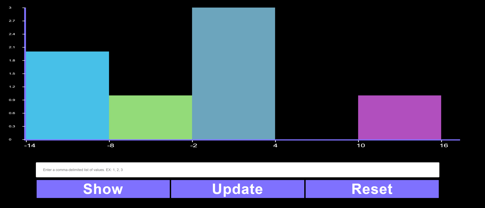

<h2 align="center">A Simple Histogram.</h2>
<h3 align="center">By Farbod Ghiasi.</h3>

## 🔧 Technologies & Tools


## Description

This is a minimalistic and extensible [Canvas](https://developer.mozilla.org/en-US/docs/Web/API/Canvas_API/Tutorial) API that renders a Histogram. It is written in JavaScript without dependency on third-party libraries.


## Running
#### Clone the repository or download index.html, style.css, and script.js all in one directory and then open the index.html file in your favorite browser.

## Features
* Acceptable input format must be comma-delimited list of values.
* The histogram is accurate no more than 2 decimal on x-axis.
* It accepts positive and negative floating points as input up to any decimal points.
* The histogram generates dynamic numbers of bars based on [The Rice Rule](https://en.wikipedia.org/wiki/Histogram) is presented as a simple alternative to Sturges' rule.
* The Rice Rule dictates the number of bars to be floor(2 * cubic root of number of data points).
* It uses device pixel ratio to support screens with high DPI.
* It is responsive on smaller or larger screens.

## Quickstart

* To play around with the Histogram, open the index.html file on your browser:
  This will take you to an URL that looks like this on your browser and the home page with randomly generated histogram is shown as follows:
    ```
    https://localhost:PORT/src/index.html
    ```
* </br></br>
* To reset the Histogram click in reset and the histogram will be reset. </br></br>
* </br></br>
* Enter your desired comma-delimited list of values in the input box and select Show button.</br></br>
* </br></br>
* See the result: </br></br>
* </br></br>
* To update the current histogram, enter your desired comma-delimited list of values in the input box and select Update button.</br></br>
* </br></br>
* see the result: </br></br>
* </br></br>

## Folder structure

This shows the folder structure of the default template.

```
histogram
├── src                   # primary app folder
│   ├── index.html        # html file to that has the display layouts
│   ├── style.css         # css file that has the style for html tags
│   └── script.js         # Histogram class that has show + update + reset functionalities.
└── images                # all the images shown in the README file that shows use cases.
```

## Road Maps from Start to End:

* It was a long time since I coded JavaScript, so I spent a couple of days finishing [JavaScript Tutorial](https://developer.mozilla.org/en-US/docs/Web/JavaScript) beginner, and Intermediate sections.
* Then I spent a day finishing [Canvas Tutorial](https://developer.mozilla.org/en-US/docs/Web/API/Canvas_API/Tutorial)
* First problem I encounter was to have a dynamic number of bars based on the given input so this wiki helped [Histogram Algorithm](https://en.wikipedia.org/wiki/Histogram).
* I used Map data structure to compute the frequencies of input. 
* I used fillRect rather than line stokes to have consistency for computing offsets.


## Resources

* [JavaScript Tutorial](https://developer.mozilla.org/en-US/docs/Web/JavaScript)
* [Canvas Tutorial](https://developer.mozilla.org/en-US/docs/Web/API/Canvas_API/Tutorial)
* [Histogram Algorithm](https://en.wikipedia.org/wiki/Histogram)
* [Inspiring YouTube Videos](https://www.youtube.com/c/Frankslaboratory)
